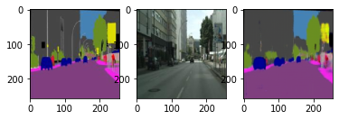
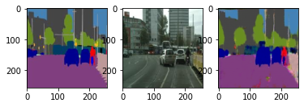
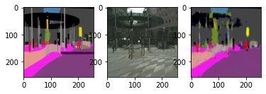
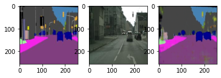
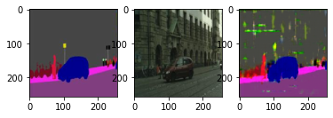
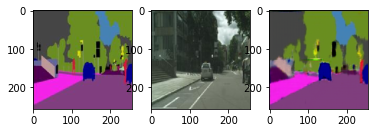
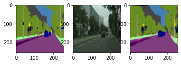
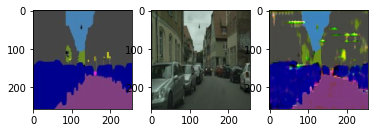

# Cityscapes Image Segmentation

### Semantic Segmentation of Images with Deep Learning

> deep-learning computer-vision cnn encoder-decoder autoencoder unet keras tensorflow

This is an implementation of the pix2pix UNet architecture for image segmentation. 

A UNet is a CNN encoder-decoder architecture where layers in the encoder are connected to corresponding layers in the decoder, ensuring better reconstruction of the input. A pix2pix model combines a UNet and a CNN classifier to form a Generative Adversarial Network. This model yields good results in image segmentation tasks.

---

### Dataset
The dataset used was the [Cityscapes Image Pairs](https://keras.io/api/applications/efficientnet/#efficientnetb0-function) dataset, which was originally built to train Autonomous Self-Driving Cars.

---
### Model

---
### Sample Outputs
Below are some outputs after training. The left column is the expected translation of the image, the middle column is the input image, and the right column is the translation predicted by the model. These are low-resolution and may be difficult to see. 

> 

> 

> 

> 

> 

> 

> 

> 

